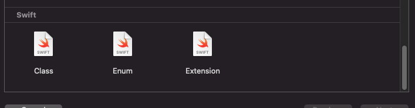

# Templates

## Installation
To install the templates in this repository you need to create the following folders. 
Folder for project templates 
`~/Library/Developer/Xcode/Templates/Project Templates` 
Folder for file templates 
`~/Library/Developer/Xcode/Templates/File Templates` 

After that you need to copy the content of the `File Templates` from this repository to the folder you created. For the project templates copy the contents of the `Project Templates` to the corresponding folder.

## Usage
After the installation you can use the templates by creating a new file in Xcode. 
